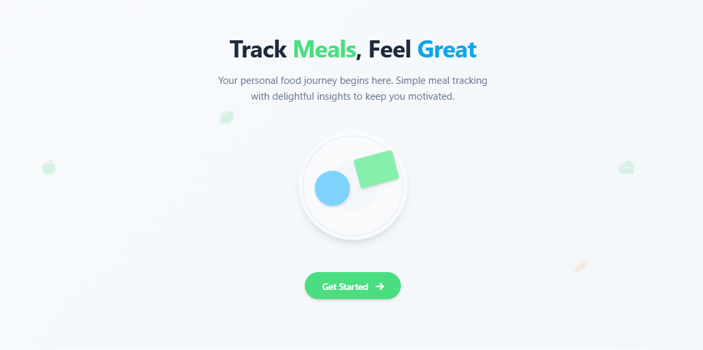
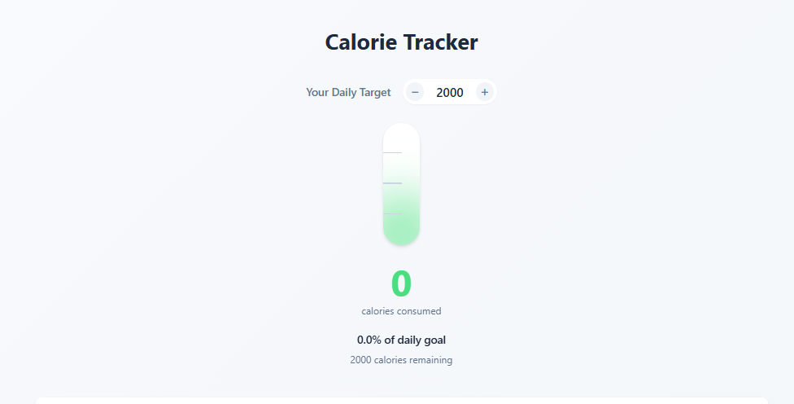

# NutriTrack - Smart Nutrition Companion 🥗

A modern web application designed to revolutionize your nutrition tracking experience through intuitive interfaces and actionable insights.

## 🎯 Main Purpose & Aim

**Primary Objective:**  
Empower users to take control of their dietary habits through:
- 📈 Visual calorie tracking
- 🍎 Simple meal logging
- 📊 Nutritional pattern analysis
- 🎯 Personalized goal setting

**Key Goals:**
1. Simplify food tracking for all user levels
2. Provide instant visual feedback on progress
3. Encourage healthy eating through positive reinforcement
4. Offer insights into nutritional patterns
5. Create an engaging user experience
   
   

## Frontend Functionality Highlights

### 1. Interactive Tracking Interface
- **Dynamic Thermometer Display**  
  Real-time calorie progress visualization with color-coded feedback
- **Smart Goal Adjustment**  
  Intuitive +/- controls for daily calorie targets
- **Portion Control System**  
  Precision portion adjustment (0.25-3x) with auto-calculation

### 2. Meal Management System
- **Visual Meal Logging**  
  Dynamic food icons with hover effects
- **Nutritional Breakdown**  
  Instant macro-nutrient calculations (Carbs/Protein/Fat)
- **Meal History Timeline**  
  Chronological display of consumed meals with calorie counts

### 3. Progress Visualization
- **Live Progress Analytics**
  - Daily calorie consumption vs goal
  - Macro-nutrient distribution pie chart
  - Weekly trend visualization
- **Achievement System**  
  Badges for consistent tracking and healthy choices

### 4. Interactive Elements
- **Floating Food Icons**  
  Animated background elements creating depth
- **3D Flip Cards**  
  Feature explanations with card-flip animations
- **Hover-Responsive Controls**  
  Visual feedback on all interactive elements
